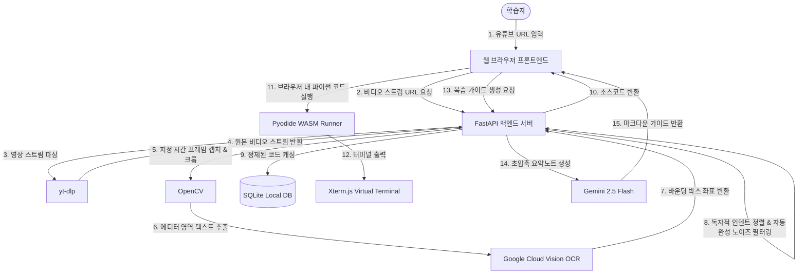

# Code-Flow: AI YouTube Coding Assistant

> **유튜브 코딩 강의 영상을 보며 직접 코드를 타자칠 필요 없이, 화면 속 코드를 실시간으로 인식하여 동기화하고 웹 브라우저에서 즉시 실행 및 AI 복습 가이드까지 받아보는 스마트 AI 학습 플랫폼**

Code-Flow는 컴퓨터 비전(OCR) 기술과 WebAssembly(WASM) 실행 엔진, 그리고 최신 LLM(Gemini 2.5 Flash)을 결합하여 동영상 코딩 교육의 학습 효율성을 극대화하는 웹 애플리케이션입니다.

---

## 💻 시스템 아키텍처 (Architecture)



---

## ✨ 핵심 기능 (Key Features)

### 1. 실시간 유튜브 코드 동기화 (Real-time Code Sync)
* **유튜브 API 연동**: 표준 YouTube IFrame Player API를 이용해 재생 시점에 싱크를 맞춥니다.
* **비디오 프레임 추출**: `yt-dlp`와 `OpenCV`를 결합하여 스트리밍 버퍼에서 실시간 프레임을 정확히 캡처합니다.
* **정밀 코드 영역 분석**: 강사의 왼쪽 파일 탐색기, 하단 터미널 등을 제외하고 순수 에디터 영역만 크롭(Cropping) 및 좌표계 보정 후 구글 OCR을 호출합니다.
* **들여쓰기(Indent) 복원 알고리즘**: 글자의 픽셀 좌표와 평균 글자 너비를 계산하여 파이썬에서 가장 중요한 공백 들여쓰기를 완벽하게 복원합니다.

### 2. 자동완성 도움말(IntelliSense) 노이즈 필터링
* 강사가 타이핑할 때 나타나는 VS Code의 자동완성 추천 박스 텍스트(예: `Optional[`, `-> None` 툴팁, `param *`, `(method)` 등)를 백엔드에서 정규식 및 블랙리스트 기반으로 필터링하여 **오류 없는 순수 코드만 정제**해 에디터에 삽입합니다.

### 3. 서버리스 브라우저 내 코드 실행 (WASM Runner)
* **Pyodide 기반 실행**: 사용자가 스캔하거나 직접 수정한 파이썬 코드를 웹 어셈블리 기반 가상 파이썬 환경을 통해 브라우저 로컬에서 안전하고 격리되게 실행합니다.
* **Xterm.js 가상 터미널**: 실제 개발자 PC의 CLI와 유사한 검정 화면 가상 터미널 인터페이스를 통해 표준 출력(`stdout`)과 에러(`stderr`)를 실시간 스트리밍합니다.

### 4. 제미나이 AI 복습 가이드 (Gemini 2.5 Flash)
* **핵심 정리**: 핵심 개념 한 줄 요약(💡 오늘의 핵심 문법 요약)과 깔끔하게 정돈된 명령어 표(🛠️ 오늘 배운 주요 명령어)만 콤팩트하게 출력합니다.
* **API 키 실시간 반영(Hot-Swap)**: 제미나이 무료 API 한도 초과 시, `.env` 파일에 새 키를 적고 저장하기만 하면 백엔드 서버를 끄고 켤 필요 없이 즉시 새로운 키가 적용되어 동작합니다.

### 5. 로컬 캐싱 및 사용량 모니터링 (Cost Saving)
* **SQLite 데이터베이스**: 한 번 스캔된 영상 프레임 코드는 `ocr_cache.db` 데이터베이스에 캐싱(Cache Hit)되어 구글 Vision API 요금을 비약적으로 아낍니다.
* **구글 API 누적 사용량 측정**: 매월 사용한 Google API 누적 카운트를 브라우저 터미널 창과 DB에 영구 기록하여 무료 크레딧 범위를 모니터링합니다.

### 6. macOS 감성의 프리미엄 아카데믹 UI/UX
* **파스텔 스카이블루 테마**: 눈의 피로가 적고 차분한 파스텔 하늘색 라이트 모드 디자인을 적용했습니다.
* **어절 단위 자연스러운 줄바꿈**: 텍스트(문장, 리스트, 테이블 셀) 내용이 줄바꿈될 때 단어의 마지막 한 글자(`다.`)만 아랫줄로 밀리는 현상을 방지하고자 `word-break: keep-all;` 속성을 전면 적용했습니다.
* **로봇 마스코트 피드백**: 헤더의 귀여운 로봇 헬퍼가 호버 시 손을 흔들며 사용자 인터랙션을 강화합니다.

---

## 🛠️ 기술 스택 (Tech Stack)

### Frontend
* **Core**: Vanilla HTML5, CSS3, JavaScript (ES6+)
* **Editor**: CodeMirror 5 (Python syntax highlighting & error decoration)
* **Execution**: Pyodide (Python WebAssembly)
* **Terminal**: Xterm.js
* **Markdown Parser**: Marked.js
* **Icon Set**: Lucide Icons

### Backend
* **API Server**: FastAPI (Python)
* **Runner**: Uvicorn ASGI Server
* **Media Stream**: yt-dlp & OpenCV (cv2)
* **Vision / AI**: Google Cloud Vision API SDK, Google Generative AI SDK (Gemini)
* **Database**: SQLite3
* **Validation**: Pydantic, python-dotenv

---

## 🚀 설치 및 실행 방법 (Installation & Run)

### 1. 개발 환경 설정
* Python 3.9 이상 버전이 설치되어 있어야 합니다.

### 2. 소스코드 다운로드 및 의존성 패키지 설치
```bash
# 레포지토리 클론
git clone https://github.com/yelimk/code-flow.git
cd code-flow

# 파이썬 가상환경 구성 (선택 사항)
python -m venv venv
./venv/Scripts/activate # Windows 기준

# 필요한 파이썬 패키지 설치
pip install fastapi uvicorn yt-dlp opencv-python google-cloud-vision google-generativeai python-dotenv pydantic
```

### 3. API 키 및 자격 증명 설정
1. **Google Cloud Vision API 설정**:
   * Google Cloud Console에서 Vision API를 활성화하고 서비스 계정 키(`gcp-key.json`) 파일을 내려받아 프로젝트 루트 폴더에 넣습니다.
2. **제미나이 API 키 및 환경 변수 설정**:
   * 프로젝트 루트 폴더에 `.env` 파일을 만들고 아래 내용을 입력합니다:
     ```env
     GEMINI_API_KEY=발급받으신_Gemini_API_Key_입력
     GOOGLE_APPLICATION_CREDENTIALS=gcp-key.json
     ```

### 4. 백엔드(FastAPI) 서버 실행
```bash
python -m uvicorn main:app --host 127.0.0.1 --port 8000
```
* 서버가 성공적으로 가동되면 `http://127.0.0.1:8000`에서 백엔드 API가 활성화됩니다.

### 5. 프론트엔드 실행
* 루트 폴더의 `index.html` 파일을 더블클릭하여 브라우저로 직접 실행하거나, 로컬 웹 서버(Live Server 등)를 이용해 `http://localhost:8080` 형태로 띄워 접속합니다. (기본 포함된 `serve.ps1` 파워쉘 스크립트를 사용하여 간편 구동할 수 있습니다.)

---

## 📂 폴더 구조 (Project Structure)

```text
code-flow/
│
├── main.py              # FastAPI 백엔드 API 서버 (비디오 추출, OCR, Gemini API 연동)
├── index.html           # 프론트엔드 메인 HTML 마크업 및 클라이언트 스크립트
├── styles.css           # 파스텔 스카이블루 디자인 시스템 CSS 스타일시트
├── serve.ps1            # 로컬 프론트엔드 웹 서버 구동용 스크립트
├── ocr_cache.db         # 스캔된 비디오 프레임 코드를 담고 있는 로컬 SQLite DB 파일 (자동 생성)
├── gcp-key.json         # Google Cloud 서비스 계정 키 파일 (인증용, 사용자 추가 필요)
├── .env                 # API 키 및 서버 설정 파일 (사용자 추가 필요)
├── .gitignore           # Git 추적 제외 설정 파일
├── README.md            # 본 설명서 파일
├── Code_Flow_PRD.md     # 제품 요구사항 정의서 (PRD)
├── GCP_VISION_SETUP.md  # 구글 클라우드 비전 API 환경 구성 가이드
├── robot_idle.png       # 마스코트 로봇 대기 상태 리소스 이미지
└── robot_wave.png       # 마스코트 로봇 환영/인사 상태 리소스 이미지
```

---

## 사용한 오픈소스 라이선스 (Third-party Licenses)

이 프로젝트는 아래 오픈소스 라이브러리를 사용합니다. 각 라이브러리의 저작권 및 라이선스는 해당 프로젝트 레포지토리를 참고하세요.

### Frontend

| 라이브러리 | 라이선스 | 링크 |
|---|---|---|
| CodeMirror 5 | MIT | https://github.com/codemirror/codemirror5 |
| Pyodide | MPL 2.0 | https://github.com/pyodide/pyodide |
| Xterm.js | MIT | https://github.com/xtermjs/xterm.js |
| Marked.js | MIT | https://github.com/markedjs/marked |
| Lucide Icons | ISC | https://github.com/lucide-icons/lucide |

### Backend

| 라이브러리 | 라이선스 | 링크 |
|---|---|---|
| FastAPI | MIT | https://github.com/fastapi/fastapi |
| Uvicorn | BSD-3-Clause | https://github.com/encode/uvicorn |
| Pydantic | MIT | https://github.com/pydantic/pydantic |
| python-dotenv | BSD-3-Clause | https://github.com/theskumar/python-dotenv |
| yt-dlp | Unlicense | https://github.com/yt-dlp/yt-dlp |
| OpenCV (opencv-python) | Apache 2.0 | https://github.com/opencv/opencv-python |
| Google Cloud Vision SDK | Apache 2.0 | https://github.com/googleapis/python-vision |
| Google Generative AI SDK | Apache 2.0 | https://github.com/google-gemini/generative-ai-python |
| SQLite3 | Public Domain | https://www.sqlite.org |

---

**개발 및 유지관리** — Code-Flow Team  
**라이선스** — MIT License
